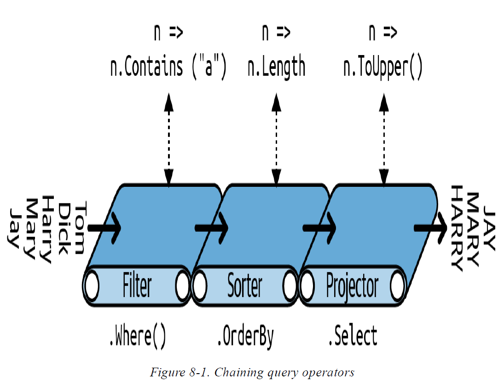

## LINQ Queries

LINQ, or Language Integrated Query, is a set of language and runtime features for writing structured type-safe queries over local object collections and remote data sources.

LINQ enables you to query any collection implementing IEnumerable `<T>`, whether an *array, list,*

Document Object Model (DOM), as well as remote data sources, such as tables in an SQL Server database. LINQ offers the benefits of both compile-time type checking and dynamic query composition.

This chapter describes the LINQ architecture and the fundamentals of writing queries. All core types are defined in the System.Linq and *System.Linq.Expressions* namespaces

***Getting Started***

The basic units of data in LINQ are sequences and elements. A sequence is any object that implements IEnumerable `<T>`, and an element is each item in the sequence. In the following example, names is a sequence, and "Tom", "Dick", and "Harry" are elements:

string[] names = { "Tom", "Dick", "Harry" };

We call this a local sequence because it represents a local collection of objects in memory.

A query operator is a method that transforms a sequence. A typical query operator accepts an input sequence and emits a transformed output sequence. In the Enumerable class in *System.Linq,* there are around 40 query operators—all implemented as static extension methods. These are called standard query operators.

*Queries that operate over local sequences are called local queries or LINQ-to-objects queries.
LINQ also supports sequences that can be dynamically fed from a remote data source such as an
SQL Server database. These sequences additionally implement the IQueryable `<T>` interface and are
supported through a matching set of standard query operators in the Queryable class.*

A query is an expression that, when enumerated, transforms sequences with query operators. The simplest query comprises one input sequence and one operator. For instance, we can apply the Where operator on a simple array to extract those strings whose length is at least four characters

```csharp
string[] names = { "Tom", "Dick", "Harry" };
IEnumerable<string> filteredNames = System.Linq.Enumerable.Where
(names, n => n.Length >= 4);
foreach (string n in filteredNames)
Console.WriteLine (n);
```

Because the standard query operators are implemented as extension methods, we can call Where directly on names, as though it were an instance method

```csharp
IEnumerable<string> filteredNames = names.Where (n => n.Length >= 4);
```

```csharp
using System;
using System.Collections.Generic;
using System.Linq;
string[] names = { "Tom", "Dick", "Harry" };
IEnumerable<string> filteredNames = names.Where (n => n.Length >=
4);
foreach (string name in filteredNames) Console.WriteLine (name);
// Dick Harry
```

We could further shorten our code by implicitly typing filteredNames:
***var filteredNames = names.Where (n => n.Length >= 4);***

Most query operators accept a lambda expression as an argument. The lambda expression helps guide and shape the query

n => n.Length >= 4

The input argument corresponds to an input element. In this case, the input argument n represents each name in the array and is of type string. The Where operator requires that the lambda expression return a bool value, which if true, indicates that the element should be included in the output sequence. Here’s its signature

```csharp
public static IEnumerable<TSource> Where<TSource> (this IEnumerable<TSource> source, Func<TSource,bool> predicate)
IEnumerable<string> filteredNames = names.Where (n => n.Contains ("a"));
foreach (string name in filteredNames)
Console.WriteLine (name); // Harry
```

So far, we’ve built queries using extension methods and lambda expressions. As you’ll see shortly, this strategy is highly composable in that it allows the chaining of query operators. In this book, we refer to this as fluent syntax.

C# also provides another syntax for writing queries, called query expression syntax. Here’s our preceding query written as a query expression

```csharp
IEnumerable<string> filteredNames = from n in names
where n.Contains ("a")
select n;
```

Fluent syntax and query syntax are complementary. In the following two sections, we explore each in more detail.

**Fluent Syntax**

Fluent syntax is the most flexible and fundamental. In this section, we describe how to chain query operators to form more complex queries—and show why extension methods are important to this process. We also describe how to formulate lambda expressions for a query operator and introduce several new query operators.

***Chaining Query Operators***

In the preceding section, we showed two simple queries, each comprising a single query operator. To build more complex queries, you append additional query operators to the expression, creating a chain. To illustrate, the following query extracts all strings containing the letter “a,” sorts them by
length, and then converts the results to uppercase:

```csharp
string[] names = { "Tom", "Dick", "Harry", "Mary", "Jay" };
IEnumerable<string> query = names
.Where (n => n.Contains ("a"))
.OrderBy (n => n.Length)
.Select (n => n.ToUpper());
foreach (string name in query) Console.WriteLine (name);
```

*The variable, n, in our example, is privately scoped to each of the lambda expressions. We can reuse
the identifier n for the same reason that we can reuse the identifier c in the following method:*

```csharp
void Test()
{
foreach (char c in "string1") Console.Write (c);
foreach (char c in "string2") Console.Write (c);
foreach (char c in "string3") Console.Write (c);
}
```

*Where*, *OrderBy*, and *Select* are standard query operators that resolve to extension methods in the Enumerable class

```csharp
// You must import the System.Linq namespace for this to compile:
IEnumerable<string> filtered = names .Where (n => n.Contains ("a"));
IEnumerable<string> sorted = filtered.OrderBy (n => n.Length);
IEnumerable<string> finalQuery = sorted .Select (n => n.ToUpper());
```

We already introduced the Where operator, which emits a filtered version of the input sequence. The OrderBy operator emits a sorted version of its input sequence; the Select method emits a sequence in which each input element is transformed or projected with a given lambda expression (n.ToUpper(),in this case). Data flows from left to right through the chain of operators, so the data is first filtered, then sorted, and then projected.

*A query operator never alters the input sequence; instead, it returns a new sequence. This is consistent with the functional programming paradigm from which LINQ was inspired.*

```csharp
public static IEnumerable<TSource> Where<TSource>
(this IEnumerable<TSource> source, Func<TSource,bool> predicate)
public static IEnumerable<TSource> OrderBy<TSource,TKey>
(this IEnumerable<TSource> source, Func<TSource,TKey> keySelector)
public static IEnumerable<TResult> Select<TSource,TResult>
(this IEnumerable<TSource> source, Func<TSource,TResult> selector)
```



```csharp
// You must import the System.Linq namespace for this to compile:
IEnumerable<string> filtered = names .Where (n => n.Contains ("a"));
IEnumerable<string> sorted = filtered.OrderBy (n => n.Length);
IEnumerable<string> finalQuery = sorted .Select (n => n.ToUpper());
```

finalQuery is compositionally identical to the query we constructed previously. Further, each intermediate step also comprises a valid query that we can execute

```csharp
              foreach (string name in filtered)
                Console.Write(name + "|"); // Harry|Mary|Jay|

            Console.WriteLine();

            foreach (string name in sorted)
                Console.Write(name + "|"); // Jay|Mary|Harry|

            Console.WriteLine();
```

**Why extension methods are important**

Instead of using extension method syntax, you can use conventional static method syntax to call the query operators:

```csharp
IEnumerable<string> filtered = Enumerable.Where(names, n => n.Contains("a"));
            IEnumerable<string> sorted = Enumerable.OrderBy(filtered, n => n.Length);
            IEnumerable<string> finalQuery = Enumerable.Select(sorted, n => n.ToUpper());

            // same as  query chaining 
            IEnumerable<string> query = names.Where(n => n.Contains("a"))
                        .OrderBy(n => n.Length)
                        .Select(n => n.ToUpper());
```

Its natural linear shape reflects the left-to-right flow of data and also keeps lambda expressions alongside their query operators (infix notation). Without extension methods, the query loses its fluency:

```csharp
IEnumerable<string> query =
   Enumerable.Select (
      Enumerable.OrderBy (
        Enumerable.Where (
       names, n => n.Contains ("a")
      ), n => n.Length
    ), n => n.ToUpper()
);
```

**Composing Lambda Expressions**

In previous examples, we fed the following lambda expression to the Where operator:

n => n.Contains ("a") // Input type = string, return type = bool.

*A lambda expression that takes a value and returns a bool is called a predicate*

A lambda expression in a query operator always works on individual elements in the input sequence
—not the sequence as a whole.

```csharp
public static IEnumerable<TSource> Where<TSource>(this IEnumerable<TSource> source, Func<TSource,bool> predicate)
{
     foreach (TSource element in source)
         if (predicate (element))  
           yield return element;
}
```

**Lambda expressions and Func signatures**

The standard query operators utilize generic Func delegates. Func is a family of general-purpose generic delegates in the System namespace, defined with the following intent:

*The type arguments in Func appear in the same order they do in lambda expressions.*

**Lambda expressions and element typing**

| Generic type letter | Meaning                                                          |
| ------------------- | ---------------------------------------------------------------- |
| TSource             | Element type for the input sequence                              |
| TResult             | Element type for the output sequence (if different from TSource) |
| TKey                | Element type for the key used in sorting, grouping, or joining   |

TSource is determined by the input sequence. TResult and TKey are typically inferred from your lambda expression.

public static IEnumerable `<TResult>` Select<TSource,TResult>
(this IEnumerable `<TSource>` source, Func<TSource,TResult> selector)

```csharp
string[] names = { "Tom", "Dick", "Harry", "Mary", "Jay" };
IEnumerable<int> query = names.Select (n => n.Length);
         foreach (int length in query)
            Console.Write (length + "|"); // 3|4|5|4|3|
```

public static IEnumerable `<TSource>` Where `<TSource>`
(this IEnumerable `<TSource>` source, Func<TSource,bool> predicate)

// Slightly simplified:
public static IEnumerable `<TSource>` OrderBy<TSource,TKey>
(this IEnumerable `<TSource>` source, Func<TSource,TKey> keySelector)

```csharp
string[] names = { "Tom", "Dick", "Harry", "Mary", "Jay" };
IEnumerable<string> sortedByLength, sortedAlphabetically;
sortedByLength = names.OrderBy (n => n.Length); // int key
sortedAlphabetically = names.OrderBy (n => n);
```
