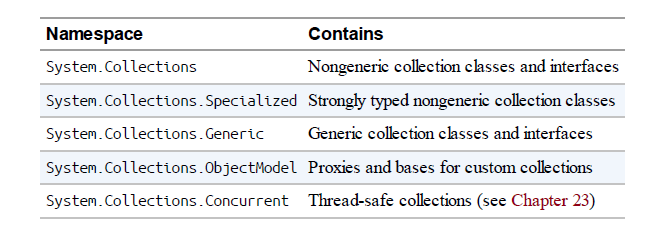
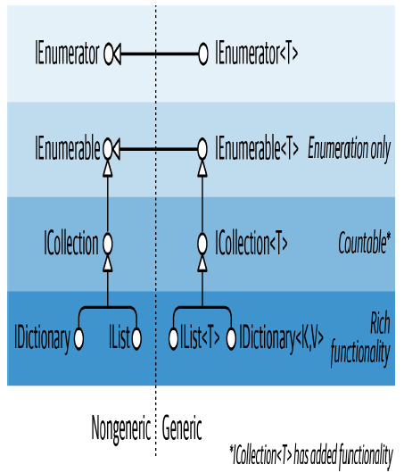

## Collections

.NET provides a standard set of types for storing and managing collections of objects. These include resizable lists, linked lists, sorted and unsorted dictionaries, and arrays.

 Of these, only arrays form part of the C# language; the remaining collections are just classes you instantiate like any other.

1. Interfaces that define standard collection protocols
2. Ready-to-use collection classes (lists, dictionaries, etc.)
3. Base classes for writing application-specific collections



**Enumeration**

In computing, there are many different kinds of collections, ranging from simple data structures, such as arrays or linked lists, to more complex ones, such as red/black trees and hashtables.

Although the internal implementation and external characteristics of these data structures vary widely, the ability to traverse the contents of the collection is an almost universal need. The .NET
BCL supports this need via a pair of interfaces (IEnumerable, IEnumerator, and their generic counterparts) that allow different data structures to expose a common traversal API. These are part of a larger set of
collection interfaces illustrated



**IEnumerable and IEnumerator**

The IEnumerator interface defines the basic low-level protocol by which elements in a collection are traversed—or enumerated—in a forward-only manner.

```csharp
public interface IEnumerator
{
bool MoveNext();
object Current { get; }
void Reset();
}
```

**IEnumerable `<T>` and IDisposable**

IEnumerator `<T>` inherits from IDisposable. This allows enumerators to hold references to resources such as database connections—and ensure that those resources are released when enumeration is complete.

**The ICollection and IList Interfaces**

Although the enumeration interfaces provide a protocol for forward-only iteration over a collection, they don’t provide a mechanism to determine the size of the collection, access a member by index, search, or modify the collection. For such functionality, .NET defines the ICollection, IList, and IDictionary interfaces. Each comes in both generic and nongeneric versions; however, the nongeneric versions exist mostly for legacy support.

**IEnumerable `<T>` (and IEnumerable)**Provides minimum functionality (enumeration only)
**ICollection `<T>` (and ICollection)** Provides medium functionality (e.g., the Count property)
**IList `<T>`/IDictionary<K,V>** and their nongeneric versions Provide maximum functionality (including “random” access by index/key)

**ICollection `<T>` and ICollection**

ICollection `<T>` is the standard interface for countable collections of objects. It provides the ability to determine the size of a collection (Count), determine whether an item exists in the collection (Contains), copy the collection into an array (ToArray), and determine whether the collection is read-only (IsReadOnly). For writable collections, you can also Add, Remove, and Clear items from the collection. And because it extends IEnumerable `<T>`, it can also be traversed via the foreach statement:

```csharp
public interface ICollection<T> : IEnumerable<T>, IEnumerable
{
int Count { get; }
bool Contains (T item);
void CopyTo (T[] array, int arrayIndex);
bool IsReadOnly { get; }
void Add(T item);
bool Remove (T item);
void Clear();
}
```

**IList `<T>` and IList**

IList `<T>` is the standard interface for collections indexable by position. In addition to the functionality inherited from ICollection `<T>` and IEnumerable `<T>`, it provides the ability to read or write an element by position (via an indexer) and insert/remove by position:

```csharp
public interface IList<T> : ICollection<T>, IEnumerable<T>, IEnumerable
{
T this [int index] { get; set; }
int IndexOf (T item);
void Insert (int index, T item);
void RemoveAt (int index);
}
```

```csharp
public interface IList : ICollection, IEnumerable
{
object this [int index] { get; set }
bool IsFixedSize { get; }
bool IsReadOnly { get; }
int Add (object value);
void Clear();
bool Contains (object value);
int IndexOf (object value);
void Insert (int index, object value);
void Remove (object value);
void RemoveAt (int index);
}
```

**IReadOnlyCollection `<T>` and IReadOnlyList `<T>`**

.NET also defines collection and list interfaces that expose just the members required for read-only operations:

```csharp
public interface IReadOnlyCollection<out T> : IEnumerable<T>, IEnumerable
{
    int Count { get; }
}
public interface IReadOnlyList<out T> : IReadOnlyCollection<T>,
IEnumerable<T>, IEnumerable
{
   T this[int index] { get; }
}
```

Because the type parameter for these interfaces is used only in output positions, it’s marked as covariant. This allows a list of cats, for instance, to be treated as a read-only list of animals. In contrast, T is not marked as covariant with ICollection `<T>` and IList `<T>`, because T is used in both input and output positions.

*These interfaces represent a read-only view of a collection or list; the underlying implementation
might still be writable. Most of the writable (mutable) collections implement both the read-only and read/write interfaces*

**The Array Class**

The Array class is the implicit base class for all single and multidimensional arrays, and it is one of the most fundamental types implementing the standard collection interfaces. The Array class provides type unification, so a common set of methods is available to all arrays, regardless of their declaration or underlying element type.

The CLR also treats array types specially upon construction, assigning them a contiguous space in memory. This makes indexing into arrays highly efficient, but prevents them from being resized later on.

Array implements the collection interfaces up to IList `<T>` in both their generic and nongeneric forms. IList `<T>` itself is implemented explicitly, though, to keep Array’s public interface clean of methods such as Add or Remove, which throw an exception on fixed-length collections such as arrays.
The Array class does actually offer a static Resize method, although this works by creating a new array and then copying over each element. As well as being inefficient, references to the array elsewhere in the program will still point to the original version. A better solution for resizable collections is to use the List `<T>` class

An array can contain value-type or reference-type elements. Value-type elements are stored in place in the array, so an array of three long integers (each 8 bytes) will occupy 24 bytes of contiguous memory. A reference type element, however, occupies only as much space in the array as a reference (4 bytes in a 32-bit environment or 8 bytes in a 64-bit environment).

```csharp
StringBuilder[] builders = new StringBuilder [5];
builders [0] = new StringBuilder ("builder1");
builders [1] = new StringBuilder ("builder2");
builders [2] = new StringBuilder ("builder3");
long[] numbers = new long [3];
numbers [0] = 12345;
numbers [1] = 54321;
```

Because Array is a class, arrays are always (themselves) reference types— regardless of the array’s element type. This means that the statement arrayB = arrayA results in two variables that reference the same array. Similarly, two distinct arrays will always fail an equality test, unless you employ a structural equality comparer, which compares every element of the array:

```csharp
object[] a1 = { "string", 123, true };
object[] a2 = { "string", 123, true };
Console.WriteLine (a1 == a2); // False
Console.WriteLine (a1.Equals (a2)); // False
IStructuralEquatable se1 = a1;
Console.WriteLine (se1.Equals (a2,
StructuralComparisons.StructuralEqualityComparer)); // True
```

**Construction and Indexing**

The easiest way to create and index arrays is through C#’s language constructs:

```csharp
int[] myArray = { 1, 2, 3 };
int first = myArray [0];
int last = myArray [myArray.Length - 1];
```

The GetValue and SetValue methods let you access elements in a dynamically created array (they also work on ordinary arrays):

```csharp
// Create a string array 2 elements in length:
Array a = Array.CreateInstance (typeof(string), 2);
a.SetValue ("hi", 0); // → a[0] = "hi";
a.SetValue ("there", 1); // → a[1] = "there";
string s = (string) a.GetValue (0); // → s = a[0];
// We can also cast to a C# array as follows:
string[] cSharpArray = (string[]) a;
string s2 = cSharpArray [0];
```

```csharp
public object GetValue (params int[] indices)
public void SetValue (object value, params int[] indices)

void WriteFirstValue (Array a)
{
Console.Write (a.Rank + "-dimensional; ");
// The indexers array will automatically initialize to all zeros, so
// passing it into GetValue or SetValue will get/set the zero-based
// (i.e., first) element in the array.
int[] indexers = new int[a.Rank];
Console.WriteLine ("First value is " + a.GetValue (indexers));
}
void Demo()
{
int[] oneD = { 1, 2, 3 };
int[,] twoD = { {5,6}, {8,9} };
WriteFirstValue (oneD); // 1-dimensional; first value is 1
WriteFirstValue (twoD); // 2-dimensional; first value is 5
}
```

**Enumeration**

Arrays are easily enumerated with a foreach statement

```csharp
int[] myArray = { 1, 2, 3};
foreach (int val in myArray)
Console.WriteLine (val);
```

You can also enumerate using the static Array.ForEach method, defined asfollows:
***public static void ForEach `<T>` (T[] array, Action `<T>` action);***
This uses an Action delegate, with this signature:
***public delegate void Action `<T>` (T obj);***
Here’s the first example rewritten with Array.ForEach:
*Array.ForEach (new[] { 1, 2, 3 }, Console.WriteLine);*

**Length and Rank**

```csharp
public int GetLength (int dimension);
public long GetLongLength (int dimension);
public int Length { get; }
public long LongLength { get; }
public int GetLowerBound (int dimension);
public int GetUpperBound (int dimension);
public int Rank { get; } // Returns number of dimensions in array
```

**Searching**

The Array class offers a range of methods for finding elements within a onedimensional array: BinarySearch methods
     For rapidly searching a sorted array for a particular item
*IndexOf/LastIndex methods*
For searching unsorted arrays for a particular item
*Find/FindLast/FindIndex/FindLastIndex/FindAll/Exists/TrueForAll*
For searching unsorted arrays for item(s) that satisfy a given
Predicate `<T>`

ordering algorithm will be applied based on its implementation of *IComparable / IComparable `<T>`.*

*public delegate bool Predicate `<T>` (T object);*

```csharp
string[] names = { "Rodney", "Jack", "Jill" };
string match = Array.Find (names, ContainsA);
Console.WriteLine (match); // Jack
ContainsA (string name) { return name.Contains ("a"); }
```

```csharp
string[] names = { "Rodney", "Jack", "Jill" };
string match = Array.Find (names, n => n.Contains ("a")); // Jack
```

***Sorting***

Array has the following built-in sorting methods

```csharp
// For sorting a single array:
public static void Sort `<T>` (T[] array);
public static void Sort (Array array);
// For sorting a pair of arrays:
public static void Sort<TKey,TValue> (TKey[] keys, TValue[] items);
public static void Sort (Array keys, Array items);
```

```csharp
int index // Starting index at which to begin sorting
int length // Number of elements to sort
IComparer<T> comparer // Object making ordering decisions
Comparison<T> comparison // Delegate making ordering decisions
//The following illustrates the simplest use of Sort:
int[] numbers = { 3, 2, 1 };
Array.Sort (numbers); // Array is now { 1, 2, 3
```

```csharp
int[] numbers = { 3, 2, 1 };
string[] words = { "three", "two", "one" };
Array.Sort (numbers, words);
// numbers array is now { 1, 2, 3 }
// words array is now { "one", "two", "three" }
```

***Converting and Resizing***

Array.ConvertAll creates and returns a new array of element type TOutput, calling the supplied Converter delegate to copy over the elements. Converter is defined as follows:

***public delegate TOutput Converter<TInput,TOutput> (TInput input)***

```csharp
float[] reals = { 1.3f, 1.5f, 1.8f };
int[] wholes = Array.ConvertAll (reals, r => Convert.ToInt32 (r));
// wholes array is { 1, 2, 2 }
```
