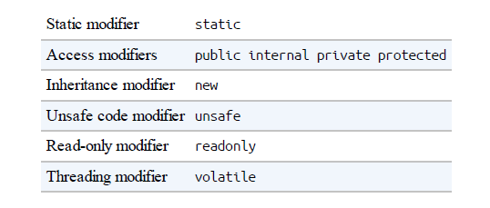

To compile an application, the dotnet tool requires a project file as well as one or more C# files. The following command scaffolds a new console project (creates its basic structure):

**dotnet new console -n  CreatingTypes**

To build and run your program, run the following command from the CreatingTypes folder:

**dotnet run CreatingTypes**

OR

dotnet build CreatingTypes.csproj

## Classes

A class is the most common kind of reference type. The simplest possible class declaration is as follows:

```csharp
class YourClassName
{
}
```

| Preceding the keyword class | Attributes and class modifiers. The non-nested class modifiers are public<br />internal, abstract, sealed, static, unsafe, and partial.          |
| --------------------------- | ------------------------------------------------------------------------------------------------------------------------------------------------ |
| Following  YourClassName  | Generic type parameters and constraints, a base class, and interfaces.                                                                           |
| Within the braces          | Class members (these are methods, properties, indexers, events, fields,<br />constructors, overloaded operators, nested types, and a finalizer). |
|                             |                                                                                                                                                  |

**Fields**

A field is a variable that is a member of a class or struct;

```csharp
class Octopus
{
string name;
public int Age = 10;
}
```



There are two popular naming conventions for private fields: camel-cased (e.g., firstName), and camel-cased with an underscore (_firstName). The latter convention lets you instantly distinguish private fields from parameters and local variables.

**The readonly modifier**

The readonly modifier prevents a field from being modified after construction. A read-only field can be assigned only in its declaration or within the enclosing type's constructor

    **public readonly age;**

**Field initialization**

Field initialization is optional. An uninitialized field has a default value

(0,'\0', null, false). Field initializers run before constructors:
**public int Age = 10;**
A field initializer can contain expressions and call methods:
**static readonly string TempFolder = System.IO.Path.GetTempPath();**

**Constants**

A constant is declared with the const keyword and must be initialized with a value.

**public const string Message = "Hello World";**

A constant can serve a similar role to a static readonly field, but it is much more restrictive—both in the types you can use and in field initialization semantics. A constant also differs from a static readonly
field in that the evaluation of the constant occurs at compile time

```csharp
public static double Circumference (double radius)
{
     return 2 * System.Math.PI * radius;
}
public const decimal ProgramVersion = 2.3;
```
