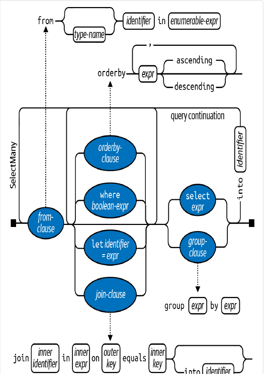
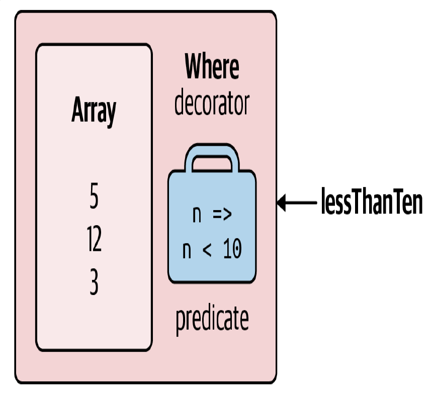
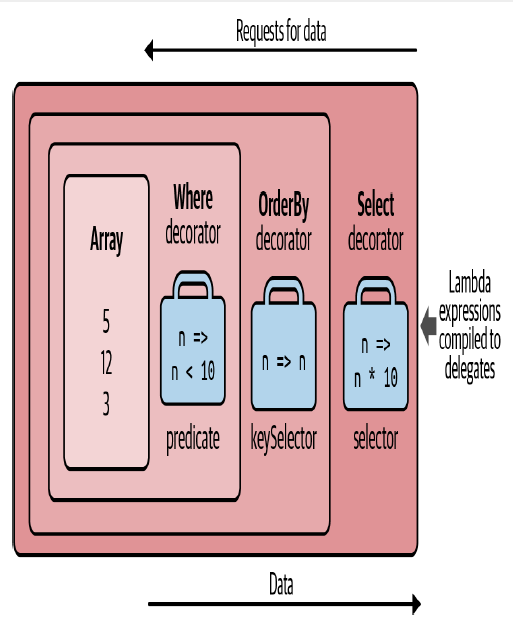
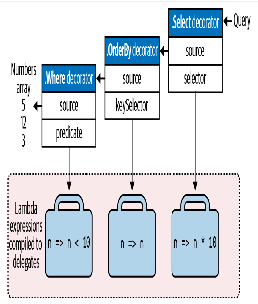
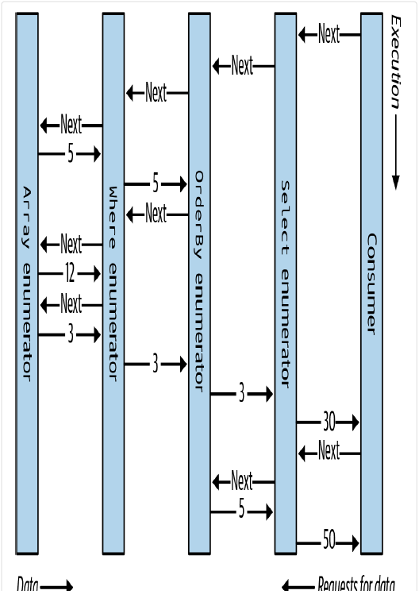
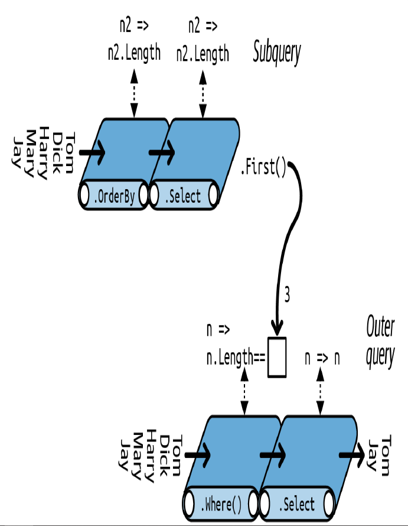
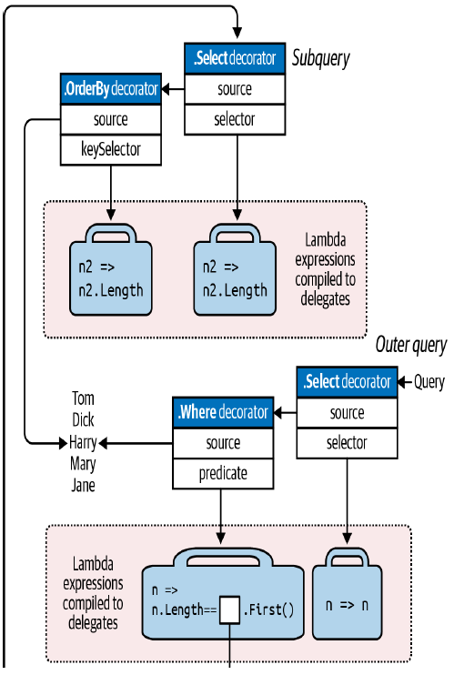

## LINQ Queries

LINQ, or Language Integrated Query, is a set of language and runtime features for writing structured type-safe queries over local object collections and remote data sources.

LINQ enables you to query any collection implementing IEnumerable `<T>`, whether an *array, list,*

Document Object Model (DOM), as well as remote data sources, such as tables in an SQL Server database. LINQ offers the benefits of both compile-time type checking and dynamic query composition.

This chapter describes the LINQ architecture and the fundamentals of writing queries. All core types are defined in the System.Linq and *System.Linq.Expressions* namespaces

***Getting Started***

The basic units of data in LINQ are sequences and elements. A sequence is any object that implements IEnumerable `<T>`, and an element is each item in the sequence. In the following example, names is a sequence, and "Tom", "Dick", and "Harry" are elements:

string[] names = { "Tom", "Dick", "Harry" };

We call this a local sequence because it represents a local collection of objects in memory.

A query operator is a method that transforms a sequence. A typical query operator accepts an input sequence and emits a transformed output sequence. In the Enumerable class in *System.Linq,* there are around 40 query operators—all implemented as static extension methods. These are called standard query operators.

*Queries that operate over local sequences are called local queries or LINQ-to-objects queries.
LINQ also supports sequences that can be dynamically fed from a remote data source such as an
SQL Server database. These sequences additionally implement the IQueryable `<T>` interface and are
supported through a matching set of standard query operators in the Queryable class.*

A query is an expression that, when enumerated, transforms sequences with query operators. The simplest query comprises one input sequence and one operator. For instance, we can apply the Where operator on a simple array to extract those strings whose length is at least four characters

```csharp
string[] names = { "Tom", "Dick", "Harry" };
IEnumerable<string> filteredNames = System.Linq.Enumerable.Where
(names, n => n.Length >= 4);
foreach (string n in filteredNames)
Console.WriteLine (n);
```

Because the standard query operators are implemented as extension methods, we can call Where directly on names, as though it were an instance method

```csharp
IEnumerable<string> filteredNames = names.Where (n => n.Length >= 4);
```

```csharp
using System;
using System.Collections.Generic;
using System.Linq;
string[] names = { "Tom", "Dick", "Harry" };
IEnumerable<string> filteredNames = names.Where (n => n.Length >=
4);
foreach (string name in filteredNames) Console.WriteLine (name);
// Dick Harry
```

We could further shorten our code by implicitly typing filteredNames:
***var filteredNames = names.Where (n => n.Length >= 4);***

Most query operators accept a lambda expression as an argument. The lambda expression helps guide and shape the query

n => n.Length >= 4

The input argument corresponds to an input element. In this case, the input argument n represents each name in the array and is of type string. The Where operator requires that the lambda expression return a bool value, which if true, indicates that the element should be included in the output sequence. Here’s its signature

```csharp
public static IEnumerable<TSource> Where<TSource> (this IEnumerable<TSource> source, Func<TSource,bool> predicate)
IEnumerable<string> filteredNames = names.Where (n => n.Contains ("a"));
foreach (string name in filteredNames)
Console.WriteLine (name); // Harry
```

So far, we’ve built queries using extension methods and lambda expressions. As you’ll see shortly, this strategy is highly composable in that it allows the chaining of query operators. In this book, we refer to this as fluent syntax.

C# also provides another syntax for writing queries, called query expression syntax. Here’s our preceding query written as a query expression

```csharp
IEnumerable<string> filteredNames = from n in names
where n.Contains ("a")
select n;
```

Fluent syntax and query syntax are complementary. In the following two sections, we explore each in more detail.

**Fluent Syntax**

Fluent syntax is the most flexible and fundamental. In this section, we describe how to chain query operators to form more complex queries—and show why extension methods are important to this process. We also describe how to formulate lambda expressions for a query operator and introduce several new query operators.

***Chaining Query Operators***

In the preceding section, we showed two simple queries, each comprising a single query operator. To build more complex queries, you append additional query operators to the expression, creating a chain. To illustrate, the following query extracts all strings containing the letter “a,” sorts them by
length, and then converts the results to uppercase:

```csharp
string[] names = { "Tom", "Dick", "Harry", "Mary", "Jay" };
IEnumerable<string> query = names
.Where (n => n.Contains ("a"))
.OrderBy (n => n.Length)
.Select (n => n.ToUpper());
foreach (string name in query) Console.WriteLine (name);
```

*The variable, n, in our example, is privately scoped to each of the lambda expressions. We can reuse
the identifier n for the same reason that we can reuse the identifier c in the following method:*

```csharp
void Test()
{
foreach (char c in "string1") Console.Write (c);
foreach (char c in "string2") Console.Write (c);
foreach (char c in "string3") Console.Write (c);
}
```

*Where*, *OrderBy*, and *Select* are standard query operators that resolve to extension methods in the Enumerable class

```csharp
// You must import the System.Linq namespace for this to compile:
IEnumerable<string> filtered = names .Where (n => n.Contains ("a"));
IEnumerable<string> sorted = filtered.OrderBy (n => n.Length);
IEnumerable<string> finalQuery = sorted .Select (n => n.ToUpper());
```

We already introduced the Where operator, which emits a filtered version of the input sequence. The OrderBy operator emits a sorted version of its input sequence; the Select method emits a sequence in which each input element is transformed or projected with a given lambda expression (n.ToUpper(),in this case). Data flows from left to right through the chain of operators, so the data is first filtered, then sorted, and then projected.

*A query operator never alters the input sequence; instead, it returns a new sequence. This is consistent with the functional programming paradigm from which LINQ was inspired.*

```csharp
public static IEnumerable<TSource> Where<TSource>
(this IEnumerable<TSource> source, Func<TSource,bool> predicate)
public static IEnumerable<TSource> OrderBy<TSource,TKey>
(this IEnumerable<TSource> source, Func<TSource,TKey> keySelector)
public static IEnumerable<TResult> Select<TSource,TResult>
(this IEnumerable<TSource> source, Func<TSource,TResult> selector)
```


```csharp
// You must import the System.Linq namespace for this to compile:
IEnumerable<string> filtered = names .Where (n => n.Contains ("a"));
IEnumerable<string> sorted = filtered.OrderBy (n => n.Length);
IEnumerable<string> finalQuery = sorted .Select (n => n.ToUpper());
```

finalQuery is compositionally identical to the query we constructed previously. Further, each intermediate step also comprises a valid query that we can execute

```csharp
              foreach (string name in filtered)
                Console.Write(name + "|"); // Harry|Mary|Jay|

            Console.WriteLine();

            foreach (string name in sorted)
                Console.Write(name + "|"); // Jay|Mary|Harry|

            Console.WriteLine();
```

**Why extension methods are important**

Instead of using extension method syntax, you can use conventional static method syntax to call the query operators:

```csharp
IEnumerable<string> filtered = Enumerable.Where(names, n => n.Contains("a"));
            IEnumerable<string> sorted = Enumerable.OrderBy(filtered, n => n.Length);
            IEnumerable<string> finalQuery = Enumerable.Select(sorted, n => n.ToUpper());

            // same as  query chaining 
            IEnumerable<string> query = names.Where(n => n.Contains("a"))
                        .OrderBy(n => n.Length)
                        .Select(n => n.ToUpper());
```

Its natural linear shape reflects the left-to-right flow of data and also keeps lambda expressions alongside their query operators (infix notation). Without extension methods, the query loses its fluency:

```csharp
IEnumerable<string> query =
   Enumerable.Select (
      Enumerable.OrderBy (
        Enumerable.Where (
       names, n => n.Contains ("a")
      ), n => n.Length
    ), n => n.ToUpper()
);
```

**Composing Lambda Expressions**

In previous examples, we fed the following lambda expression to the Where operator:

n => n.Contains ("a") // Input type = string, return type = bool.

*A lambda expression that takes a value and returns a bool is called a predicate*

A lambda expression in a query operator always works on individual elements in the input sequence
—not the sequence as a whole.

```csharp
public static IEnumerable<TSource> Where<TSource>(this IEnumerable<TSource> source, Func<TSource,bool> predicate)
{
     foreach (TSource element in source)
         if (predicate (element))  
           yield return element;
}
```

**Lambda expressions and Func signatures**

The standard query operators utilize generic Func delegates. Func is a family of general-purpose generic delegates in the System namespace, defined with the following intent:

*The type arguments in Func appear in the same order they do in lambda expressions.*

**Lambda expressions and element typing**

| Generic type letter | Meaning                                                          |
| ------------------- | ---------------------------------------------------------------- |
| TSource             | Element type for the input sequence                              |
| TResult             | Element type for the output sequence (if different from TSource) |
| TKey                | Element type for the key used in sorting, grouping, or joining   |

TSource is determined by the input sequence. TResult and TKey are typically inferred from your lambda expression.

public static IEnumerable `<TResult>` Select<TSource,TResult>
(this IEnumerable `<TSource>` source, Func<TSource,TResult> selector)

```csharp
string[] names = { "Tom", "Dick", "Harry", "Mary", "Jay" };
IEnumerable<int> query = names.Select (n => n.Length);
         foreach (int length in query)
            Console.Write (length + "|"); // 3|4|5|4|3|
```

public static IEnumerable `<TSource>` Where `<TSource>`
(this IEnumerable `<TSource>` source, Func<TSource,bool> predicate)

// Slightly simplified:
public static IEnumerable `<TSource>` OrderBy<TSource,TKey>
(this IEnumerable `<TSource>` source, Func<TSource,TKey> keySelector)

```csharp
string[] names = { "Tom", "Dick", "Harry", "Mary", "Jay" };
IEnumerable<string> sortedByLength, sortedAlphabetically;
sortedByLength = names.OrderBy (n => n.Length); // int key
sortedAlphabetically = names.OrderBy (n => n);
```

## Natural Ordering

The original ordering of elements within an input sequence is significant in LINQ. Some query operators rely on this ordering, such as Take, Skip, and Reverse.

The Take operator outputs the first x elements, discarding the rest:

int[] numbers = { 10, 9, 8, 7, 6 };
IEnumerable `<int>` firstThree = numbers.Take (3); // { 10, 9, 8 }

The Skip operator ignores the first x elements and outputs the rest:

IEnumerable `<int>` lastTwo = numbers.Skip (3); // { 7, 6 }

Reverse does exactly as it says:

IEnumerable `<int>` reversed = numbers.Reverse(); // { 6, 7, 8, 9, 10 }

***Other Operators***

Not all query operators return a sequence. The element operators extract one element from the input sequence; examples are *First, Last,* and *ElementAt*

```csharp
int[] numbers = { 10, 9, 8, 7, 6 };
int firstNumber = numbers.First(); // 10
int lastNumber = numbers.Last(); // 6
int secondNumber = numbers.ElementAt(1); // 9
int secondLowest = numbers.OrderBy(n=>n).Skip(1).First(); // 7
```

Because these operators return a single element, you don’t usually call further query operators on their result unless that element itself is a collection.

The aggregation operators return a scalar value, usually of numeric type:

```csharp
int count = numbers.Count(); // 5;
int min = numbers.Min(); // 6;
```

The quantifiers return a bool value:

```csharp
bool hasTheNumberNine = numbers.Contains (9); // true
bool hasMoreThanZeroElements = numbers.Any(); // true
bool hasAnOddElement = numbers.Any (n => n % 2 != 0); // true
```

Some query operators accept two input sequences. Examples are Concat, which appends one sequence to another, and Union, which does the same but with duplicates removed:

```csharp
int[] seq1 = { 1, 2, 3 };
int[] seq2 = { 3, 4, 5 };
IEnumerable<int> concat = seq1.Concat (seq2); // { 1, 2, 3, 3, 4, 5 }
IEnumerable<int> union = seq1.Union (seq2); // { 1, 2, 3, 4, 5 }
```

## Query Expressions

C# provides a syntactic shortcut for writing LINQ queries, called query expressions. Contrary to popular belief, a query expression is not a means of embedding SQL into C#.

In the preceding section, we wrote a fluent-syntax query to extract strings containing the letter “a”, sorted by length and converted to uppercase. Here's the same thing in query syntax

```csharp
 string[] names = { "Tom", "Dick", "Harry", "Mary", "Jay" };
            IEnumerable<string> query =
                    from n in names
                    where n.Contains("a") // Filter elements
                    orderby n.Length // Sort elements
                    select n.ToUpper(); // Translate each element  (project)

            foreach (string name in query) Console.WriteLine(name);
```

Query expressions always start with a from clause and end with either a select or group clause. The from clause declares a range variable (in this case, n), which you can think of as traversing the input sequence—rather like  ***foreach***.

*To read this diagram, start at the left and then proceed along the track as if you were a train. For instance, after the mandatory from clause, you can optionally include an orderby, where, let, or join clause. After that, you can either continue with a select or group clause, or go back and include another from, orderby, where, let, or join clause.*



The compiler processes a query expression by translating it into fluent syntax.

 It does this in a fairly mechanical fashion—much like it translates foreach statements into calls to GetEnumerator and MoveNext. This means that anything you can write in query syntax you can also write in fluent syntax. The compiler (initially) translates our example query into the following:

```csharp
IEnumerable<string> query = names.Where (n => n.Contains ("a"))
.OrderBy (n => n.Length)
.Select (n => n.ToUpper());
```

*Range Variables*

The identifier immediately following the from keyword syntax is called the range variable.

A range variable refers to the current element in the sequence on which the operation is to be performed

In our examples, the range variable n appears in every clause in the query. And yet, the variable actually enumerates over a different sequence with each clause:

```csharp
from n in names // n is our range variable
where n.Contains ("a") // n = directly from the array
orderby n.Length // n = subsequent to being filtered
select n.ToUpper() // n = subsequent to being sorted
```

This becomes clear when we examine the compiler’s mechanical translation to fluent syntax:

```csharp
var rr = names.Where (n => n.Contains ("a")) // Locally scoped n
.OrderBy (n => n.Length) // Locally scoped n
.Select (n => n.ToUpper()) // Locally scoped n
```

As you can see, each instance of n is scoped privately to its own lambda expression

Query expressions also let you introduce new range variables via the following clauses:

1. **let**
2. **into**
3. An additional **from** clause
4. **join**

**Query Syntax Versus SQL Syntax**

Query expressions look superficially like SQL, yet the two are very different. A LINQ query boils down to a C# expression, and so follows standard C# rules.

 For example, with LINQ, you cannot use a variable before you declare it. In SQL, you can reference a table alias in the SELECT clause before defining it in a FROM clause.

A subquery in LINQ is just another C# expression and so requires no special syntax. Subqueries in SQL are subject to special rules.

With LINQ, data logically flows from left to right through the query. With SQL, the order is less well structured with regard to data flow.

A LINQ query comprises a conveyor belt or pipeline of operators that accept and emit sequences whose element order can matter. An SQL query comprises a network of clauses that work mostly with unordered sets.

**Query Syntax Versus Fluent Syntax**

Query and fluent syntax each have advantages.
Query syntax is simpler for queries that involve any of the following:

1. A let clause for introducing a new variable alongside the range variable
2. SelectMany, Join, or GroupJoin, followed by an outer range variable reference

***Where, Select, SelectMany OrderBy, ThenBy, OrderByDescending, ThenByDescending GroupBy, Join, GroupJoin***

### Mixed-Syntax Queries

If a query operator has no query-syntax support, you can mix query syntax and fluent syntax. The only restriction is that each query-syntax component must be complete (i.e., start with a from clause and end with a select or group clause). Assuming this array declaration

string[] names = { "Tom", "Dick", "Harry", "Mary", "Jay" };

the following example counts the number of names containing the letter “a”:

```csharp
int matches = (from n in names where n.Contains ("a") select n).Count();
// 3
string first = (from n in names orderby n select n).First(); // Dick
```

The mixed-syntax approach is sometimes beneficial in more complex queries. With these simple examples, however, we could stick to fluent syntax throughout without penalty:

**Deferred Execution**

An important feature of most query operators is that they execute not when constructed but when enumerated (in other words, when MoveNext is called on its enumerator). Consider the following query:

```csharp
var numbers = new List<int> { 1 };
IEnumerable<int> query = numbers.Select (n => n * 10); // Build query
numbers.Add (2); // Sneak in an extra element
foreach (int n in query)
Console.Write (n + "|"); // 10|20|
```

This is called deferred or lazy execution and is the same as what happens with delegates:

All standard query operators provide deferred execution, with the following exceptions:

1. Operators that return a single element or scalar value, such as **First or Count**
2. The following conversion operators:

ToArray, ToList, ToDictionary, ToLookup, ToHashSet

These operators cause immediate query execution because their result types have no mechanism to provide deferred execution. The Count method, for instance, returns a simple integer, which doesn’t then get enumerated. The following query is executed immediately:

```csharp
int matches = numbers.Where (n => n <= 2).Count(); // 1
```

Deferred execution is important because it decouples query construction from query execution. This allows you to construct a query in several steps and also makes database queries possible.

***Subqueries provide another level of indirection. Everything in a subquery is subject to deferred execution, including aggregation and conversion methods.***

***Reevaluation***

Deferred execution has another consequence: a deferred execution query is reevaluated when you reenumerate:

```csharp
var numbers = new List<int>() { 1, 2 };
IEnumerable<int> query = numbers.Select (n => n * 10);
foreach (int n in query) Console.Write (n + "|"); // 10|20|
numbers.Clear();
foreach (int n in query) Console.Write (n + "|"); // <nothing
```

```csharp
 var numbers = new List<int>() { 1, 2 };
            List<int> timesTen = numbers
            .Select(n => n * 10)
            .ToList(); // Executes immediately into a List<int>
            numbers.Clear();
            Console.WriteLine(timesTen.Count); // Still
```

Captured Variables

If your query’s lambda expressions capture outer variables, the query will honor the value of those variables at the time the query runs:

```csharp
int[] numbers = { 1, 2 };
int factor = 10;
IEnumerable<int> query = numbers.Select (n => n * factor);
factor = 20;
foreach (int n in query) Console.Write (n + "|"); // 20|40|
```

This can be a trap when building up a query within a for loop. For example, suppose that we want to remove all vowels from a string. The following, although inefficient, gives the correct result:

***How Deferred Execution Works***

Query operators provide deferred execution by returning decorator sequences.

Unlike a traditional collection class such as an array or linked list, a decorator sequence (in general) has no backing structure of its own to store elements.

Instead, it wraps another sequence that you supply at runtime, to which it maintains a permanent dependency. Whenever you request data from a decorator, it in turn must request data from the wrapped input sequence.

```csharp
IEnumerable<int> lessThanTen = new int[] { 5, 12, 3 }.Where (n => n < 10);
```



**Chaining Decorators**

Chaining query operators creates a layering of decorators. Consider the following query:

```csharp
IEnumerable<int> query = new int[] { 5, 12, 3 }.Where (n => n < 10)
.OrderBy (n => n)
.Select (n => n * 10);
```



When you enumerate query, you’re querying the original array, transformed through a layering or chain of decorators.

*Adding ToList onto the end of this query would cause the preceding operators to execute immediately, collapsing the whole object model into a single list*

**Select's** decorator references the **OrderBy** decorator, which references **Where's** decorator, which references the **array**.
A feature of deferred execution is that you build the identical object model if you compose the query progressively:

```csharp
IEnumerable<int>
source = new int[] { 5, 12, 3 },
filtered = source .Where (n => n < 10),
sorted = filtered .OrderBy (n => n),
query = sorted .Select (n => n * 10);
```



**How Queries Are Executed**

Here are the results of enumerating the preceding query

```csharp
foreach (int n in query) Console.WriteLine (n);
```

Behind the scenes, the foreach calls **GetEnumerator** on **Select's** decorator (the last or outermost operator), which kicks off everything. The
result is a chain of enumerators that structurally mirrors the chain of  decorator sequences.

## Subqueries

A subquery is a query contained within another query’s lambda expression. The following example uses a subquery to sort musicians by their last name:

```csharp
string[] musos =
{ "David Gilmour", "Roger Waters", "Rick Wright", "Nick Mason" };
IEnumerable<string> query = musos.OrderBy (m => m.Split().Last());
```

**m.Split** converts each string into a collection of words, upon which we then call the Last query operator. **m.Split().Last** is the subquery; query references the outer query.

Subqueries are permitted because you can put any valid C# expression on the righthand side of a lambda. A subquery is simply another C# expression. This means that the rules for subqueries are a consequence of the rules for lambda expressions (and the behavior of query operators in general).

*A subquery is privately scoped to the enclosing expression and can reference parameters in the outer lambda expression (or range variables in a query expression).*
**m.Split().Last** is a very simple subquery. The next query retrieves all strings in an array whose length matches that of the shortest string:

```csharp
 string[] names = { "Tom", "Dick", "Harry", "Mary", "Jay" };
            IEnumerable<string> outerQuery = names
            .Where(n => n.Length == names.OrderBy(n2 => n2.Length)
            .Select(n2 =>
            n2.Length).First());

            // Here's the same thing as a Query Expression
            IEnumerable<string> outerQueryExpression =
                    from n in names
                    where n.Length ==
                    (from n2 in names
                     orderby n2.Length
                     select
                     n2.Length).First()
                    select n;
```

Because the outer range variable (n) is in scope for a subquery, we cannot reuse n as the subquery's range variable.
A subquery is executed whenever the enclosing lambda expression is evaluated. This means that a subquery is executed upon demand, at the discretion of the outer query. You could say that execution proceeds from the outside in. Local queries follow this model literally; interpreted queries



```csharp
string[] names = { "Tom", "Dick", "Harry", "Mary", "Jay" };
            IEnumerable<string> query =
                        from n in names
                        where n.Length == names.OrderBy(n2 => n2.Length).First().Length
                        select n;
            // With the Min aggregation function, we can simplify the query further:
            IEnumerable<string> queryExpression =
                                    from n in names
                                    where n.Length == names.Min(n2 => n2.Length)
                                    select n;
```



#### Subqueries and Deferred Execution

An element or aggregation operator such as First or Count in a subquery doesn’t force the outer query into immediate execution—deferred execution still holds for the outer query. This is because subqueries are called
indirectly—through a delegate in the case of a local query, or through an expression tree in the case of an interpreted query.

An interesting case arises when you include a subquery within a Select expression. In the case of a local query, you’re actually projecting a sequence of queries—each itself subject to deferred execution. The effect is generally transparent, and it serves to further improve efficiency

#### Composition Strategies

1. Progressive query construction
2. Using the **into** keyword
3. Wrapping queries

**Progressive Query Building**

```csharp
            string[] names = { "Tom", "Dick", "Harry", "Mary", "Jay" };
            var filtered = names.Where(n => n.Contains("a"));
            var sorted = filtered.OrderBy(n => n);
            var query = sorted.Select(n => n.ToUpper());
```

Because each of the participating query operators returns a decorator sequence, the resultant query is the same chain or layering of decorators that you would get from a single-expression query. There are a couple of potential benefits, however, to building queries progressively:

It can make queries easier to write

You can add query operators conditionally. For example

if (includeFilter) query = query.Where (...)

query = query.Where (n => !includeFilter || `<expression>`)

because it avoids adding an extra query operator if includeFilter is false.

A progressive approach is often useful in query comprehensions. Imagine that we want to remove all vowels from a list of names and then present in alphabetical order those whose length is still more than two characters. In fluent syntax, we could write this query as a single expression—by projecting before we filter:

```csharp
string[] names = { "Tom", "Dick", "Harry", "Mary", "Jay" };
            IEnumerable<string> query = names
                        .Select(n => n.Replace("a", "").Replace("e", "").Replace("i", "")
                        .Replace("o", "").Replace("u", ""))
                        .Where(n => n.Length > 2)
                        .OrderBy(n => n);
            // Dck
            // Hrry
            // Mry

            // here's Same as 
            IEnumerable<string> query2 =
                            from n in names
                            where n.Length > 2
                            orderby n
                            select n.Replace("a", "").Replace("e", "").Replace("i", "")
                            .Replace("o", "").Replace("u", "");
            // Fortunately, there are a number of ways to get the original result in query syntax. 
            // The first is by querying progressively:

            IEnumerable<string> query3 =
                            from n in names
                            select n.Replace("a", "").Replace("e", "").Replace("i", "")
                            .Replace("o", "").Replace("u", "");
            query3 = from n in query3 where n.Length > 2 orderby n select n;
```

##### **The *into* Keyword**

The into keyword is interpreted in two very different ways by query expressions, depending on context. The meaning we’re describing now is for signaling query continuation (the other is for signaling a *GroupJoin*).

The into keyword lets you “continue” a query after a projection and is a shortcut for progressively querying. With into, we can rewrite the preceding query as follows:

```csharp
  string[] names = { "Tom", "Dick", "Harry", "Mary", "Jay" };
            IEnumerable<string> query =
                        from n in names
                        select n.Replace("a", "").Replace("e", "").Replace("i", "")
                        .Replace("o", "").Replace("u", "")
                        into noVowel
                        where noVowel.Length > 2
                        orderby noVowel
                        select noVowel;
```

The only place you can use into is after a select or *group* clause. into “restarts” a query, allowing you to introduce fresh *where*, *orderby*, and *select* clauses.

*Although it’s easiest to think of into as restarting a query from the perspective of a query expression, it’s all one query when translated to its final fluent form. Hence, there’s no intrinsic performance hit with into. Nor do you lose any points for its use!*

The equivalent of into in fluent syntax is simply a longer chain of operators

##### Scoping rules

All range variables are out of scope following an into keyword.

```csharp
var query =
from n1 in names
select n1.ToUpper()
into n2 // Only n2 is visible from here on.
where n1.Contains ("x") // Illegal: n1 is not in scope.
select n2;
```

consider how this maps to fluent syntax

```csharp
var query = names
.Select (n1 => n1.ToUpper())
.Where (n2 => n1.Contains ("x")); // Error: n1 no longer in scope
```

##### Wrapping Queries

A query built progressively can be formulated into a single statement by wrapping one query around another. In general terms

*var tempQuery = tempQueryExpr
var finalQuery = from ... in tempQuery ...*
can be reformulated as:
*var finalQuery = from ... in (tempQueryExpr)*

Wrapping is semantically identical to progressive query building or using the ***into***keyword (without the intermediate variable). The end result in all cases is a linear chain of query operators.

```csharp
 string[] names = { "Tom", "Dick", "Harry", "Mary", "Jay" };
            IEnumerable<string> query =
                        from n in names
                        select n.Replace("a", "").Replace("e", "").Replace("i", "")
                        .Replace("o", "").Replace("u", "");
            query = from n in query where n.Length > 2 orderby n select n;

            // Same As Reformulated in wrapped form, it’s the following
            IEnumerable<string> query2 =
                        from n1 in
                        (
                        from n2 in names
                        select n2.Replace("a", "").Replace("e", "").Replace("i", "")
                        .Replace("o", "").Replace("u", "")
                        )
                        where n1.Length > 2
                        orderby n1
                        select n1;

            // When converted to fluent syntax, the result is the same linear chain of
            // operators as in previous examples

            IEnumerable<string> query3 = names
            .Select(n => n.Replace("a", "").Replace("e", "").Replace("i", "")
            .Replace("o", "").Replace("u", ""))
            .Where(n => n.Length > 2)
            .OrderBy(n => n);
```

Wrapped queries can be confusing because they resemble the subqueries we wrote earlier. Both have the concept of an inner and outer query. When converted to fluent syntax, however, you can see that wrapping is simply a strategy for sequentially chaining operators. The end result bears no resemblance to a subquery, which embeds an inner query within the lambda expression of another.

#### ***Projection Strategies***

**Object Initializers**

So far, all of our select clauses have projected scalar element types. With C# object initializers, you can project into more complex types. For example, suppose, as a first step in a query, we want to strip vowels from a list of names while still retaining the original versions alongside, for the benefit of subsequent queries. We can write the following class to assist

```csharp


  public class TempProjectionItem
    {
        public string Original; // Original name
        public string Vowelless; // Vowel-stripped name
    }


string[] names = { "Tom", "Dick", "Harry", "Mary", "Jay" };
IEnumerable<TempProjectionItem> temp =
from n in names
select new TempProjectionItem
{
Original = n,
Vowelless = n.Replace ("a", "").Replace ("e", "").Replace
("i", "")
.Replace ("o", "").Replace ("u", "")
};
```

##### Anonymous Types

Anonymous types allow you to structure your intermediate results without writing special classes. We can eliminate the TempProjectionItem class in our previous example with anonymous types:

```csharp
  var intermediate = from n in names
                               select new
                               {
                                   Original = n,
                                   Vowelless = n.Replace("a", "").Replace("e", "").Replace
                               ("i", "")
                               .Replace("o", "").Replace("u", "")
                               };
            IEnumerable<string> query = from item in intermediate
                                        where item.Vowelless.Length > 2
                                        select item.Original;


            var query3 = from n in names
                         select new
                         {
                             Original = n,
                             Vowelless = n.Replace("a", "").Replace("e", "").Replace("i", "")
                         .Replace("o", "").Replace("u", "")
                         }
                        into temp
                         where temp.Vowelless.Length > 2
                         select temp.Original;
```

**The let Keyword**

The let keyword introduces a new variable alongside the range variable. With let, we can write a query extracting strings whose length, excluding vowels, exceeds two characters, as follows:

```csharp
  static string[] names = { "Tom", "Dick", "Harry", "Mary", "Jay" };

        public static void LetKeyword()
        {
            IEnumerable<string> query =
                from n in names
                let vowelless = n.Replace("a", "").Replace("e", "").Replace
                ("i", "")
                .Replace("o", "").Replace("u", "")
                where vowelless.Length > 2
                orderby vowelless
                select n; // Thanks to let, n is still in scope.
        }
```

The compiler resolves a *let* clause by projecting into a temporary anonymous type that contains both the range variable and the new expression variable. In other words, the compiler translates this query into the preceding example.

 let accomplishes two things:

1. It projects new elements alongside existing elements
2. It allows an expression to be used repeatedly in a query without being rewritten
3.
