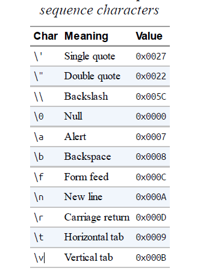

## Compilation

create new project with dotnet CLI

    **dotnet new console -n Basics**

To build and run your program, run the following command from the Basics folder:

    **dotnet run Basics**

Or, if you just want to build without running.

    **dotnet build Basics.csproj**

**Identifiers and Keywords**

Identifiers are names that programmers choose for their classes, methods, variables, and so on. Here are the identifiers in our example program, in the order in which they appear:
 **System x Console WriteLine**

Reserve Keyword

abstract as base  bool  break byte  case
do     double     else    enum    event    explicit
extern    in     int     interface      internal    is    lock    long     protected
public    readonly    record    ref    return    sbyte   throw    true   try   typeof
uint    ulong   unchecked    catch    char     checked      class    const
continue     decimal     default     delegate     false     finally
fixed     float      for      foreach     goto     if
implicit     namespace     new      null      object     operator
out      override     params     private      sealed     short     sizeof    stackalloc
static       string      struct      switch      this     unsafe     ushort
using     virtual     void       volatile     while

## Type Basics

A type defines the blueprint for a value. In this example, we use two literals of type int with values 12 and 30. We also declare a variable of type int whose name is x:

```csharp
int x = 12 * 30;
Console.WriteLine (x);
const int y = 360;
```

**Predefined Type Examples**
Predefined types are types that are specially supported by the compiler. The **int** type is a predefined type for representing the set of integers that fit into 32 bits of memory, from −2 to 2 −1, and is the default type for numeric literals within this range. You can perform functions such as arithmetic with
instances of the **int** type, as follows

int, float, double, string,  decimal, byte, bit, boolean , char, tinyint, ETC

```csharp
string message = "Hello world";
string upperMessage = message.ToUpper();
Console.WriteLine (upperMessage); // HELLO WORLD
int x = 2022;
message = message + x.ToString();
Console.WriteLine (message); // Hello world2022
```

C# type System type Suffix Size Range

| Integral—signed                                                            |
| --------------------------------------------------------------------------- |
| sbyte SByte 8 bits      –2 to 2 –1                                     |
| short Int16 16 bits     –2 to 2 –1                                     |
| int Int32 32 bits     –2 to 2 –1long Int64 L 64 bits    –2 to 2 –1 |
| nint IntPtr 32/64 bits                                                      |
| Integral—unsigned                                                          |
| byte Byte 8 bits   0 to 2 –1                                             |
| ushort UInt16 16 bits 0 to 2 –1                                            |
| uint UInt32 U 32 bits 0 to 2 –1                                            |
| ulong UInt64 UL 64 bits 0 to 2 –1                                          |
| unint UIntPtr 32/64 bits                                                    |
| Real                                                                        |
| float Single F 32 bits ± (~10 to 10 )                                      |
| double Double D 64 bits ± (~10 to 10 )                                     |
| decimal Decimal M 128 bits ± (~10 to 10 )                                  |


