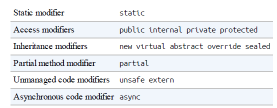
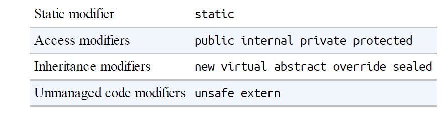

To compile an application, the dotnet tool requires a project file as well as one or more C# files. The following command scaffolds a new console project (creates its basic structure):

**dotnet new console -n  CreatingTypes**

To build and run your program, run the following command from the CreatingTypes folder:

**dotnet run CreatingTypes**

OR

dotnet build CreatingTypes.csproj

## Classes

A class is the most common kind of reference type. The simplest possible class declaration is as follows:

```csharp
class YourClassName
{
}
```

| Preceding the keyword class | Attributes and class modifiers. The non-nested class modifiers are public<br />internal, abstract, sealed, static, unsafe, and partial.          |
| --------------------------- | ------------------------------------------------------------------------------------------------------------------------------------------------ |
| Following  YourClassName  | Generic type parameters and constraints, a base class, and interfaces.                                                                           |
| Within the braces          | Class members (these are methods, properties, indexers, events, fields,<br />constructors, overloaded operators, nested types, and a finalizer). |
|                             |                                                                                                                                                  |

**Fields**

A field is a variable that is a member of a class or struct;

```csharp
class Octopus
{
string name;
public int Age = 10;
}
```


There are two popular naming conventions for private fields: camel-cased (e.g., firstName), and camel-cased with an underscore (_firstName). The latter convention lets you instantly distinguish private fields from parameters and local variables.

**The readonly modifier**

The readonly modifier prevents a field from being modified after construction. A read-only field can be assigned only in its declaration or within the enclosing type's constructor

    **public readonly age;**

**Field initialization**

Field initialization is optional. An uninitialized field has a default value

(0,'\0', null, false). Field initializers run before constructors:
**public int Age = 10;**
A field initializer can contain expressions and call methods:
**static readonly string TempFolder = System.IO.Path.GetTempPath();**

**Constants**

A constant is declared with the const keyword and must be initialized with a value.

**public const string Message = "Hello World";**

A constant can serve a similar role to a static readonly field, but it is much more restrictive—both in the types you can use and in field initialization semantics. A constant also differs from a static readonly
field in that the evaluation of the constant occurs at compile time

```csharp
public static double Circumference (double radius)
{
     return 2 * System.Math.PI * radius;
}
public const decimal ProgramVersion = 2.3;
```

**Method**

    A method performs an action in a series of statements. A method can receive input data from the caller by specifying parameters and output data back to the caller by specifying a return type. A method can specify a void return type, indicating that it doesn't return any value to its caller. A method can
also output data back to the caller via ref/out parameters. A method's signature must be unique within the type. A method's signature comprises its name and parameter types in order (but not the parameter names, nor the return type).



```csharp


namespace Method
{
    public class MethodAbout
    {
        int Foo(int x) { return x * 2; }
        //Expression-bodied methods
        int Foo1(int x) => x * 2;
        // Expression-bodied functions can also have a void return type:
        void Foo2(int x) => Console.WriteLine(x);

        // Local methods
        // You can define a method within another method:
        void WriteCubes()
        {
            Console.WriteLine(Cube(3));
            Console.WriteLine(Cube(4));
            Console.WriteLine(Cube(5));
            int Cube(int value) => value * value * value;
        }

        //Overloading methods
        void Foo4(int x) { }
        void Foo4(double x) { }
        void Foo4(int x, float y) { }
        void Foo4(float x, int y) { }

        /**
However, the following pairs of methods cannot coexist in the same type,
because the return type and the params modifier are not part of a method’s signature

        */

    }
}
```

**Object Initializers**

To simplify object initialization, any accessible fields or properties of an object can be set via an object initializer directly after construction

```csharp

public class Bunny
{
    public string Name;
    public bool LikesCarrots;
    public bool LikesHumans;
    public Bunny () {}
    public Bunny (string n) { Name = n; 
}
// Note parameterless constructors can omit empty parentheses
Bunny b1 = new Bunny { Name="Bo", LikesCarrots=true, LikesHumans=false };
Bunny b2 = new Bunny ("Bo") { LikesCarrots=true, LikesHumans=false };

Bunny temp1 = new Bunny(); // temp1 is a compiler-generated name
temp1.Name = "Bo";
temp1.LikesCarrots = true;
temp1.LikesHumans = false;
Bunny b1 = temp1;

Bunny temp2 = new Bunny ("Bo");
temp2.LikesCarrots = true;
temp2.LikesHumans = false;
Bunny b2 = temp2;
```

**The this Reference**

The **this** reference refers to the instance itself. the **Marry** method uses this to set the partner's mate field:

```csharp
public class Panda
{
  public Panda Mate;
  public void Marry (Panda partner)
  {
    Mate = partner;
    partner.Mate = this;
  }
}
```

The this reference also disambiguates a local variable or parameter from a field;

```csharp
public class Test
{
string name;
public Test (string name) { this.name = name; }
}
```

The **this** reference is valid only within nonstatic members of a **class** or **struct**.

***Properties***

Properties look like fields from the outside, but internally they contain logic, like methods do

```csharp
public class Stock
{
    decimal currentPrice; // The private "backing" field
   public decimal CurrentPrice // The public property
    {
       get { return currentPrice; }
       set { currentPrice = value; }
     }
}
```

get and set denote property accessors. The get accessor runs when the property is read. It must return a value of the property’s type. The set accessor runs when the property is assigned. It has an implicit parameter named value of the property’s type that you typically assign to a private field



**Read-only Properties**

A property is read-only if it specifies only a get accessor,

```csharp
decimal currentPrice, sharesOwned;
public decimal Worth
{
   get { return currentPrice * sharesOwned; }
}
public decimal Worth1 => currentPrice * sharesOwned;
//With a little extra syntax, set accessors can also be expression-bodied:
public decimal Worth2
{
get => currentPrice * sharesOwned;
set => sharesOwned = value / currentPrice;
}
```

**Automatic properties**

The most common implementation for a property is a getter and/or setter that simply reads and writes to a private field of the same type as the property. An automatic property declaration instructs the compiler to provide this implementation.

```csharp
public class Stock
{

   public decimal CurrentPrice { get; set; }
  //Property initializers
   public decimal CurrentPrice1 { get; set; } = 123;
   public int Maximum { get; } = 999;
}
```

**get and set accessibility**

The get and set accessors can have different access levels. The typical use case for this is to have a public property with an internal or private access modifier on the setter:

```csharp
public class Foo
{
  private decimal x;
   public decimal X
  {
    get { return x; }
    private set { x = Math.Round (value, 2); }
   }
}
```

**Init-only setters**

you can declare a property accessor with init instead of set:

```csharp
public class Note
{
   public int Pitch { get; init; } = 20; // “Init-only” property
   public int Duration { get; init; } = 100; // “Init-only” property
}
```

These init-only properties act like read-only properties, except that they can also be set via an object initializer:

```csharp
var note = new Note { Pitch = 50 };
```

Init-only properties cannot even be set from inside their class, except via their property initializer, the constructor, or another init-only accessor.

```csharp
public class Note
{
   public int Pitch { get; }
   public int Duration { get; }
   public Note (int pitch = 20, int duration = 100)
   {
    Pitch = pitch; Duration = duration;
   }
   readonly int _pitch;
   public int Pitch1 { get => _pitch; init => _pitch = value; }
}
```

**Indexers**

Indexers provide a natural syntax for accessing elements in a class or struct that encapsulate a list or dictionary of values. Indexers are similar to properties but are accessed via an index argument rather than a property name. The string class has an indexer that lets you access each of its char values via an int index:

```csharp
string s = "hello";
Console.WriteLine (s[0]); // 'h'
Console.WriteLine (s[3]); // 'l'
```

Implementing an indexer

To write an indexer, define a property called **this**, specifying the arguments in square brackets

```csharp
class Sentence
{
   string[] words = "The quick brown fox".Split();
   public string this [int wordNum] // indexer
   {
      get { return words [wordNum]; }
     set { words [wordNum] = value; }
   }
   public string this [Index index] => words [index];
  public string[] this [Range range] => words [range];
}

Sentence s = new Sentence();
Console.WriteLine (s[3]); // fox
s[3] = "kangaroo";
Console.WriteLine (s[3]); // kangaroo
```

**Static constructors and field initialization order**

Static field initializers run just before the static constructor is called. If a type has no static constructor, static field initializers will execute just prior to the type being used—or anytime earlier at the whim of the runtime.

```csharp
class Foo
{
  public static int X = Y; // 0
  public static int Y = 3; // 3
  public static Foo Instance = new Foo();
  public static int XX = 3;
  Foo() => Console.WriteLine (X); // 0
}
```

**Static Classes**

A class marked static cannot be instantiated or subclassed, and must be composed solely of static members. The System.Console and System.Math classes are good examples of static classes.

```csharp
public static Person{

}
```

**Finalizers**

Finalizers are class-only methods that execute before the garbage collector reclaims the memory for an unreferenced object. The syntax for a finalizer is the name of the class prefixed with the ~ symbol:

```csharp
class Class1
{
   ~Class1()
  {

  }
}
```

**The nameof operator**

The nameof operator returns the name of any symbol (type, member, variable, and so on) as a string

```csharp
int count = 123;
string name = nameof (count); // name is "count
string name = nameof (StringBuilder.Length);
```

## Inheritance

A class can inherit from another class to extend or customize the original class. Inheriting from a class lets you reuse the functionality in that class instead of building it from scratch. A class can inherit from only a single class but can itself be inherited by many classes, thus forming a class hierarchy. In this example, we begin by defining a class called Asset:

```csharp
public class Asset
{
 public string Name;
}
public class Stock : Asset // inherits from Asset
{
   public long SharesOwned;
}
public class House : Asset // inherits from Asset
{
  public decimal Mortgage;
}

Stock msft = new Stock { Name="MSFT",SharesOwned=1000 };
Console.WriteLine (msft.Name); // MSFT
Console.WriteLine (msft.SharesOwned); // 1000
House mansion = new House { Name="Mansion", Mortgage=250000 };
Console.WriteLine (mansion.Name); // Mansion
Console.WriteLine (mansion.Mortgage); // 250000

```

Polymorphism

References are polymorphic. This means a variable of type x can refer to an object that subclasses x. For instance, consider the following method:

```csharp
public static void Display (Asset asset)
{
System.Console.WriteLine (asset.Name);
}
```
